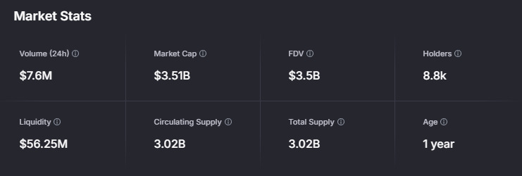
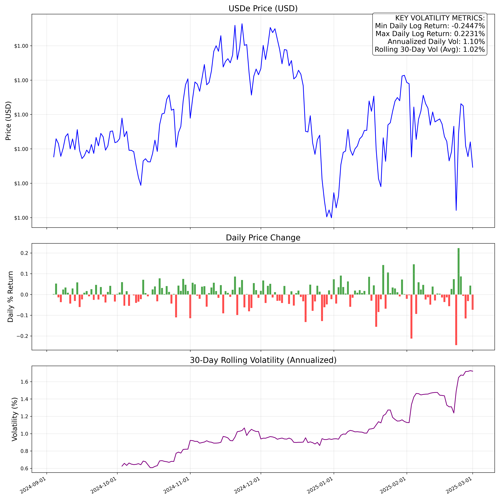
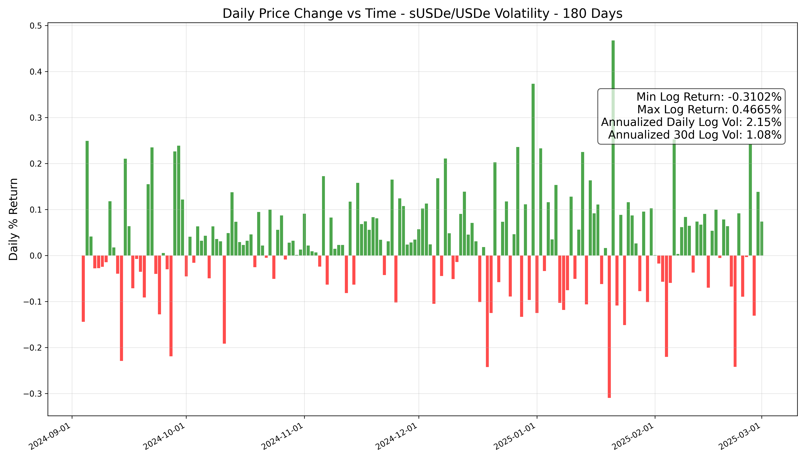
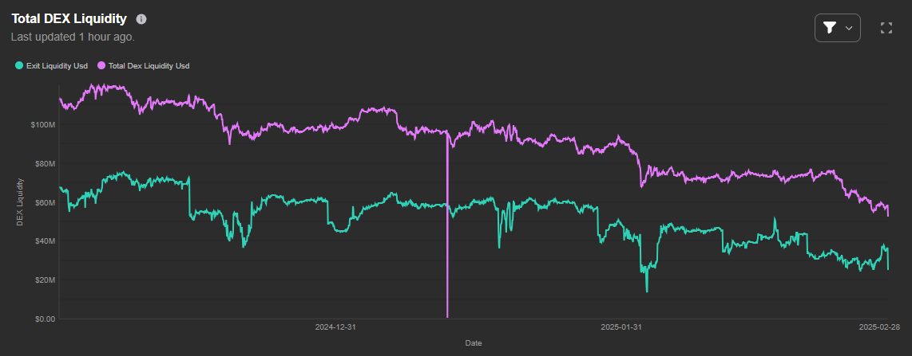
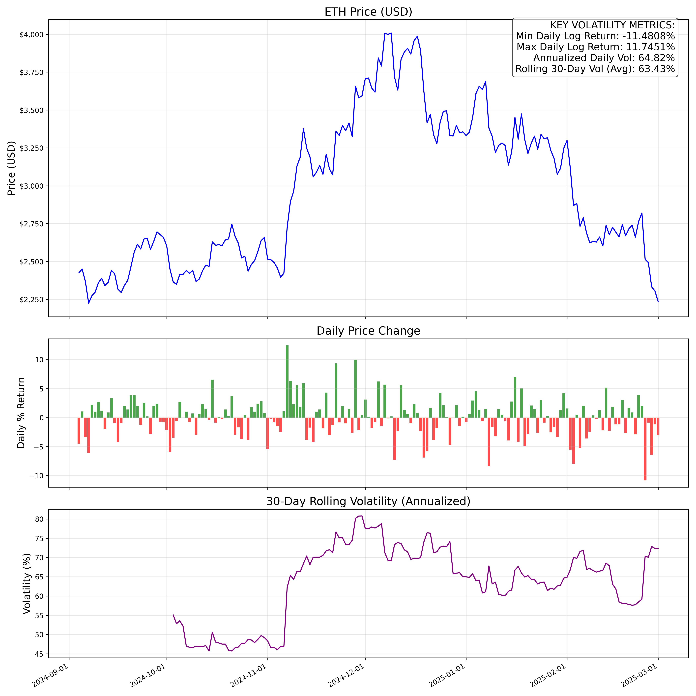
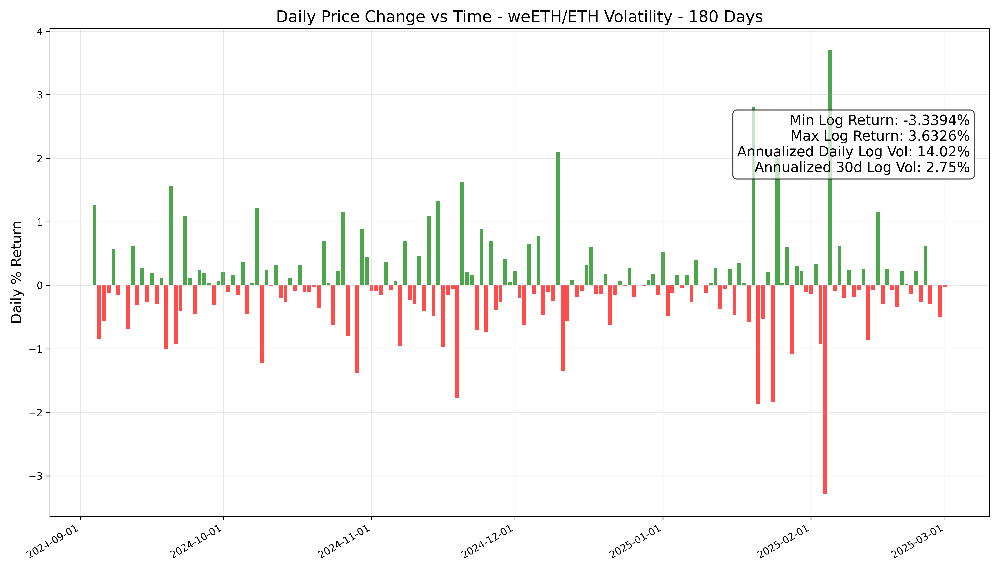
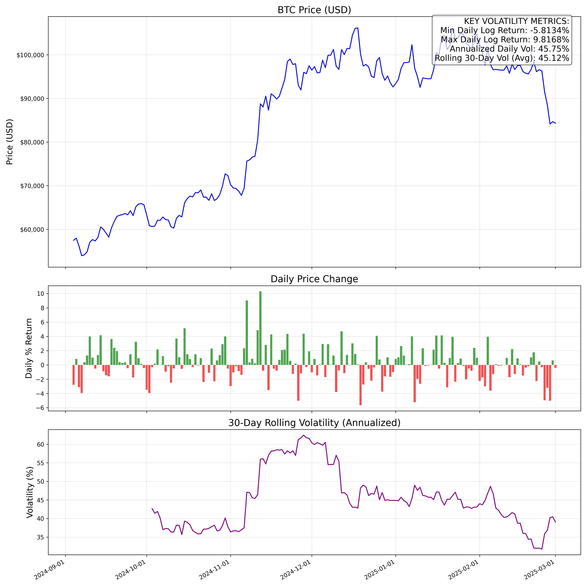
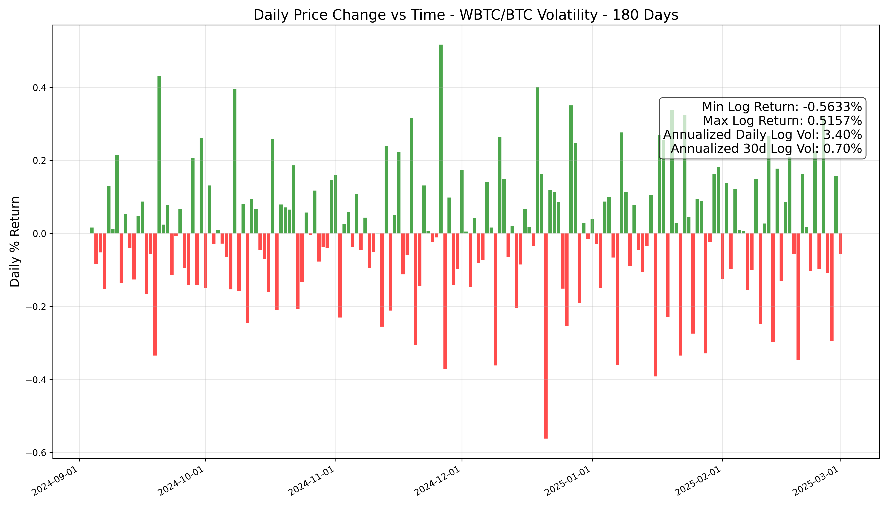
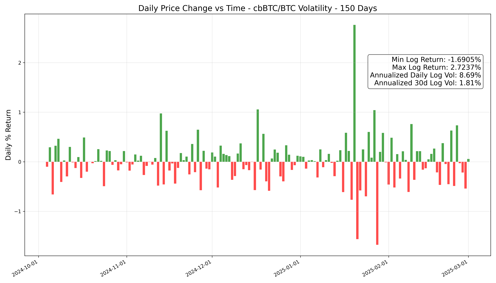
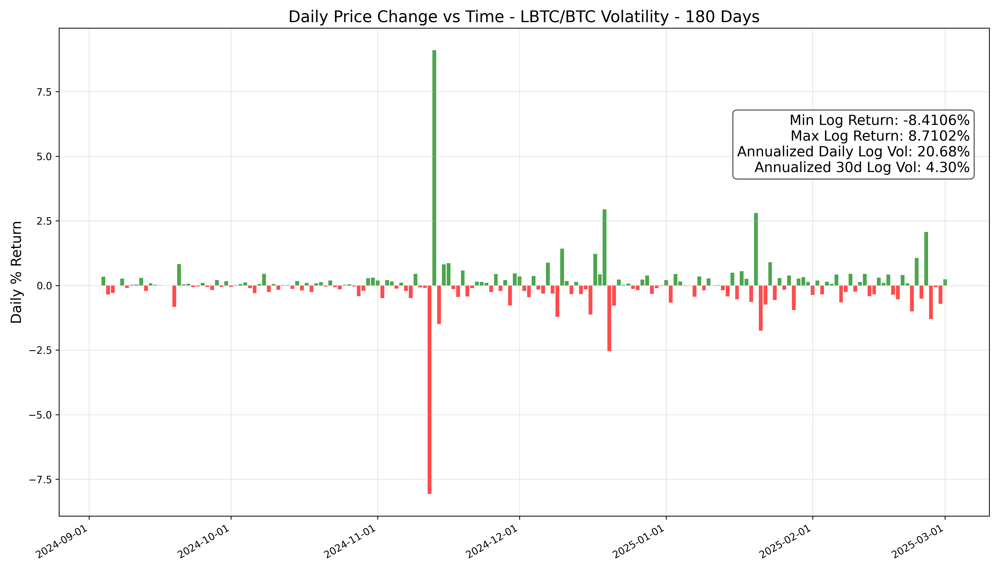

# **Parameter Recommendations**
[Anthias Labs](https://www.anthias.xyz) - March 2025

## Methodology

### Minimum Collateralization Ratio

A good MCR should balance capital efficiency for users while ensuring protocol solvency. Highly volatile or illiquid assets should have lower MCRs to account for potential sharp price drops and slippage during liquidations, while stable and liquid assets can support higher MCRs.

When determining MCR, we assess the following factors:

- 30d Annualized Volatility of the Asset-to-Underlying Ratio:
    - This metric captures any tracking error or basis risk between the derivative and its underlying asset. If the ratio is volatile, it indicates that the derivative isn't tracking the underlying consistently, which could lead to unexpected collateral requirements during rapid market moves.
- Volatility of the Underlying Asset:
    - Since these derivatives are fundamentally linked to underlying assets such as ETH or BTC, the inherent volatility of the underlying asset drives the overall risk profile.
- Amount of liquidity of the asset across all DEXs & how much can be liquidated profitably:
    - Ample liquidity ensures profitable liquidations.
- Competitive state of the overall lending market:
    - What are other lending protocols setting their LTVs at for a particular asset?

### Debt Caps

When setting debt caps we aim to allow the highest amount of funds to be supplied as possible while making sure that:

1. There is sufficient DEX liquidity to support liquidation of *collateral-at-risk.*
2. We prevent price manipulation attacks. 

*Collateral-at-risk: Positions at risk of liquidation given a x% downward price shock*

$$
\text{Debt Cap}=\frac{A(1-B)}{C}
$$

Where:

- **A**: Amount able to be profitably liquidated via DEX (swap from token to USDC)
- **B**: Allocation of DEX liquidity to other lending markets
    - (65%–95%, risk-dependent: Lower Risk = 0.95, Mid Risk = 0.85, Higher Risk = 0.65).
- **C**: Percentage of collateral that is underwater/liquidatable in an "extreme drop".
    - Small Cap (<$2B) - 50%
    - Medium Cap ($2B-$20B) - 35%
    - Large Cap (>$20B) - 15%
    
The debt caps provided should be considered as targets. In practice, the available supply of ebUSD post-TGE will likely impose a stricter limit. Therefore, we recommend beginning with a conservative debt cap and scaling it progressively as the ebUSD supply grows following TGE.

**NOTE:** There will be certain assets that are onboarded, in which we have hesitancies about their risk profile. Two examples would be sBOLD and LBTC, sBOLD is not a focal point of this report so this mainly applies to LBTC. If we want to integrate such assets into the protocol without exposing the protocol to unnecessary extra risk, we can set extremely conservative caps, until we are more confident in the collateral profile. 

- Set debt cap to $100K - $250K (USD converted) and slowly scale up

### Oracles

For assets with high liquidity and an established market presence, a market price oracle is typically preferred. The rationale is that the market naturally aggregates diverse views on the asset's value, ensuring that the price feed reflects the fair market value.

There is, however, a case to be made for sUSDe. Due to its dependency on USDe and the inherent risks of depegging, relying solely on a market price oracle could expose the protocol to unnecessary short-term volatility. We take a deeper dive in sUSDe's "Oracle Configuration" section.

### Scaling Debt Caps

If any asset sees >70% utilization, trigger a review to increase the cap. We would want to verify if increasing debt cap makes sense given the current liquidity profile of the asset as well as ebUSD.

# **sUSDe**

## Supply and Liquidity

The supply of USDe has seen steady growth since its inception, and currently sits on a total supply of $5.8B. A significant portion of USDe is staked as sUSDe, currently around 60%, down from its peak of 77% in December 2024. 

Source: [https://matcha.xyz/tokens/ethereum/0x9d39a5de30e57443bff2a8307a4256c8797a3497](https://matcha.xyz/tokens/ethereum/0x9d39a5de30e57443bff2a8307a4256c8797a3497)

Source: [https://dune.com/hashed_official/ethena](https://dune.com/hashed_official/ethena)

Source: [https://dune.com/entropy_advisors/ethena-susde-usde-staking](https://dune.com/entropy_advisors/ethena-susde-usde-staking)

Source: [https://app.odos.xyz/advanced](https://app.odos.xyz/advanced) (3/3/25)

## Volatility

Underlying volatility (USDe)

The annualized daily log volatility for sUSDe/USDe is 2.15%, reflecting strong parity with the underlying USDe.

## Recommendations

### Minimum Collateralization Ratio (MCR)

We recommend setting the initial MCR to 120 (~83% LTV). 

Conservative: 80% LTV

Moderate: 84% LTV

Risk-On: 88% LTV

### Debt Cap

The debt cap formula: Debt Cap = A(1-B)/C

Where:
- A: $15,000,000 (amount liquidatable at <4% slippage)
- C: 0.35 (Medium Cap)

**Low Risk**: $15,000,000 * (1-0.95) / 0.35 = $2,150,000

**Medium Risk**: $15,000,000 * (1-0.85) / 0.35 = $6,430,000

**Higher Risk**: $15,000,000 * (1-0.65) / 0.35 = $15,000,000

### Oracle Configuration

If USDe experiences a depeg, sUSDe is likely to face an even more severe depeg due to its dependency on USDe's stability, amplifying the risk for sUSDe holders. Aave's previous sUSDe price oracle combined the Chainlink's sUSDe/USDe exchange rate oracle with USDe/USD market oracle, which ties sUSDe-backed positions closely to short-term fluctuations in USDe's market price. This setup exposes the protocol to significant risks: if USDe temporarily depegs sUSDe positions could quickly become liquidatable, even if USDe remains sufficiently backed. However, limited liquidity on decentralized exchanges may prevent profitable liquidations, potentially leaving the protocol with bad debt. While Ethena's insurance fund and redemption mechanisms are likely to restore the peg in this scenario, the reliance on market-driven price feeds introduces unnecessary short-term vulnerability. Given that USDe is predominantly minted with USDT, Chaos and Llama Risk proposed to replace the USDe market price oracle with a USDT/USD oracle. This would stabilize USDe's price within Aave by aligning it with the more stable USDT feed, reducing the risk of unnecessary liquidations and allowing time for protocol adjustments if needed.

More on this can be read here: [link](https://governance.aave.com/t/arfc-susde-and-usde-price-feed-update/20495/7)

A better solution might be to use a proof-of-reserves oracle. Therefore, short term fluctuations wouldn't risk bad debt. Previously there wasn't a way to get live proof-of-reserves data for Ethena, the closest thing they had was monthly attestations released by their custodians. However as of very recently there seems to be a proof-of-reserves oracle in development by Chaos Labs ([link](https://governance.aave.com/t/arfc-susde-and-usde-price-feed-update/20495/7)). Given the risks of market price oracles in the context of Ethena we believe this could be the way to go long-term. In the meantime a Chainlink or Redstone market oracle will suffice.

# **weETH**

## Supply and Liquidity

EtherFi's TVL has experienced significant growth over the past year, driven largely by eETH. While DEX liquidity for weETH remains robust—with about $28M available at a <4% price impact—the slight decline over the past three months calls for ongoing monitoring. This trend could indicate evolving market dynamics that may affect collateral valuations in the near term.

Source: [https://matcha.xyz/tokens/ethereum/0xcd5fe23c85820f7b72d0926fc9b05b43e359b7ee](https://matcha.xyz/tokens/ethereum/0xcd5fe23c85820f7b72d0926fc9b05b43e359b7ee)

Source: [https://dune.com/ether_fi/etherfi](https://dune.com/ether_fi/etherfi)

Source: [https://dashboards.gauntlet.xyz/applied-research/eigenlayer/assets/0xcd5fe23c85820f7b72d0926fc9b05b43e359b7ee](https://dashboards.gauntlet.xyz/applied-research/eigenlayer/assets/0xcd5fe23c85820f7b72d0926fc9b05b43e359b7ee)

Source: [https://app.odos.xyz/advanced](https://app.odos.xyz/advanced) (3/3/25)

## Volatility

Underlying volatility (ETH)

Outside of a temporary volatility spike in early February 2025, weETH has largely maintained strong parity with its underlying asset.

## Recommendations

### Minimum Collateralization Ratio (MCR)

Recommend an initial MCR of 135 (~74% LTV) to accommodate the observed volatility and recent liquidity trends.

Conservative: 70% LTV

Moderate: 74% LTV

Risk-On: 78% LTV

### Debt Cap

The debt cap formula: Debt Cap = A(1-B)/C

Where:
- A: $24,000,000 (amount liquidatable at <4% slippage)
- C: 0.35 (Medium Cap)

**Low Risk**: $24,000,000 * (1-0.95) / 0.35 = $3,430,000

**Medium Risk**: $24,000,000 * (1-0.85) / 0.35 = $10,290,000

**Higher Risk**: $24,000,000 * (1-0.65) / 0.35 = $24,000,000

### Oracle Configuration

A weETH/USD market price oracle should suffice for weETH. As a liquid wrapper for eETH, which represents staked ETH in the EigenLayer protocol, weETH's value is tied to the underlying staked assets and their rewards. Since weETH is actively traded on exchanges, its market price reflects its fair value based on real-time supply and demand. A reputable oracle provider, such as Chainlink or Redstone, can reliably aggregate this data from multiple sources. Unlike pegged assets, weETH does not require a specialized oracle, as its value naturally tracks the performance of staked ETH, adjusted for rewards or penalties, which the market efficiently prices in. Thus, a standard market price oracle meets Ebisu's operational needs effectively.

# **WBTC**

## Supply and Liquidity

WBTC continues to be a highly liquid asset with strong market adoption. Its integration across multiple exchanges and DeFi platforms reinforces its broad trading base, ensuring robust liquidity and making it a cornerstone asset within Ebisu.

Source: [https://matcha.xyz/tokens/ethereum/0x2260fac5e5542a773aa44fbcfedf7c193bc2c599](https://matcha.xyz/tokens/ethereum/0x2260fac5e5542a773aa44fbcfedf7c193bc2c599)

Source: [https://app.odos.xyz/advanced](https://app.odos.xyz/advanced) (3/3/25)

## Volatility

Underlying volatility (BTC)

## Recommendations

### Minimum Collateralization Ratio (MCR)

We recommend the initial MCR for WBTC be set to 138 (~72.5% LTV)

Conservative: 68% LTV

Moderate: 72% LTV

Risk-On: 76% LTV

### Debt Cap

The debt cap formula: Debt Cap = A(1-B)/C

Where:
- A: $50,000,000 (amount liquidatable at <4% slippage)
- C: 0.35 (Medium Cap)

**Low Risk**: $50,000,000 * (1-0.95) / 0.35 = $7,140,000

**Medium Risk**: $50,000,000 * (1-0.85) / 0.35 = $21,430,000

**Higher Risk**: $50,000,000 * (1-0.65) / 0.35 = $50,000,000

### Oracle Configuration

For WBTC, a market price oracle is typically the best fit given its high liquidity and broad market adoption.

# **cbBTC**

## Supply and Liquidity

Source: [https://app.odos.xyz/advanced](https://app.odos.xyz/advanced) (3/3/25)

## Volatility

## Recommendations

### Minimum Collateralization Ratio (MCR)

Recommend setting the initial MCR at 138 (~72.5% LTV), aligning it with WBTC due to similar risk profiles.

Conservative: 68% LTV

Moderate: 72% LTV

Risk-On: 76% LTV

### Debt Cap

The debt cap formula: Debt Cap = A(1-B)/C

Where:
- A: $35,000,000 (amount liquidatable at <4% slippage)
- C: 0.35 (Medium Cap)

**Low Risk**: $35,000,000 * (1-0.95) / 0.35 = $5,000,000

**Medium Risk**: $35,000,000 * (1-0.85) / 0.35 = $15,000,000

**Higher Risk**: $35,000,000 * (1-0.65) / 0.35 = $35,000,000

### Oracle Configuration

For cbBTC, similar to WBTC, a market price oracle here is best.

# **LBTC**

## Supply and Liquidity

LBTC exhibits moderate liquidity compared to other BTC derivatives.  Current data indicates steady growth and sufficient trading volumes to support its inclusion as a collateral asset in the protocol.

Source: [https://matcha.xyz/tokens/ethereum/0x8236a87084f8b84306f72007f36f2618a5634494](https://matcha.xyz/tokens/ethereum/0x8236a87084f8b84306f72007f36f2618a5634494)

Source: [https://dune.com/lombard_protocol/lbtc-defi](https://dune.com/lombard_protocol/lbtc-defi)

Source: [https://app.odos.xyz/advanced](https://app.odos.xyz/advanced) (3/3/25)

## Volatility

## Recommendations

### Minimum Collateralization Ratio (MCR)

We recommend the initial MCR for LBTC be set to 143 (~70% LTV).

Conservative: 66% LTV

Moderate: 70% LTV

Risk-On: 74% LTV

### Debt Cap

Long term, if LBTC proves to be a reliable asset:

The debt cap formula: Debt Cap = A(1-B)/C

Where:
- A: $20,000,000 (amount liquidatable at <4% slippage)
- C: 0.50 (Small Cap)

**Low Risk**: $20,000,000 * (1-0.95) / 0.50 = $2,000,000

**Medium Risk**: $20,000,000 * (1-0.85) / 0.50 = $6,000,000

**Higher Risk**: $20,000,000 * (1-0.65) / 0.50 = $14,000,000

Initially however, we recommend setting the initial debt cap for LBTC to 100-250k (USD), and scaling up from there.

### Oracle Configuration

Similar to WBTC and cbBTC, we don't see compelling evidence to use anything but a market oracle here.

# **Summary of Recommendations**

| Asset | MCR | LTV Recommendations | Debt Cap Recommendations (USD) | Oracle Type |
|-------|-----|---------------------|--------------------------------|------------|
| **sUSDe** | 120 | Conservative: 80% Moderate: 84% Risk-On: 88% | Low Risk: $2.15M Medium Risk: $6.43M Higher Risk: $15M | Proof-of-reserves oracle (long-term) Market price (interim) |
| **weETH** | 135 | Conservative: 70% Moderate: 74% Risk-On: 78% | Low Risk: $3.43M Medium Risk: $10.29M Higher Risk: $24M | Market price oracle |
| **WBTC** | 138 | Conservative: 68% Moderate: 72% Risk-On: 76% | Low Risk: $7.14M Medium Risk: $21.43M Higher Risk: $50M | Market price oracle |
| **cbBTC** | 138 | Conservative: 68% Moderate: 72% Risk-On: 76% | Low Risk: $5M Medium Risk: $15M Higher Risk: $35M | Market price oracle |
| **LBTC** | 143 | Conservative: 66% Moderate: 70% Risk-On: 74% | Initial: $100K-$250K  Long-term: Low Risk: $2M Medium Risk: $6M Higher Risk: $14M | Market price oracle |